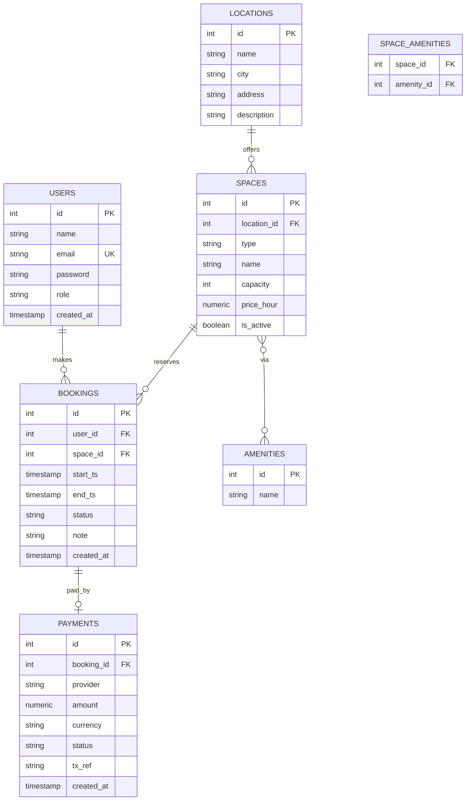

# Schema ER – CoWorkSpace (testuale + mermaid)

## Entità principali
- **Users**(id, name, email, password, role, created_at)
- **Locations**(id, name, city, address, description)
- **Spaces**(id, location_id, type, name, capacity, price_hour, amenities, is_active)
- **Bookings**(id, user_id, space_id, start_ts, end_ts, status, note, created_at)
- **Payments**(id, booking_id, provider, amount, currency, status, tx_ref, created_at)
- **Amenities**(id, name)
- **SpaceAmenities**(space_id, amenity_id)

## Relazioni
- Un **User** effettua molte **Bookings**
- Una **Booking** riguarda uno **Space**
- Uno **Space** appartiene ad una **Location**
- Uno **Space** ha molti **Amenities** tramite **SpaceAmenities**
- Una **Booking** può avere un **Payment**

